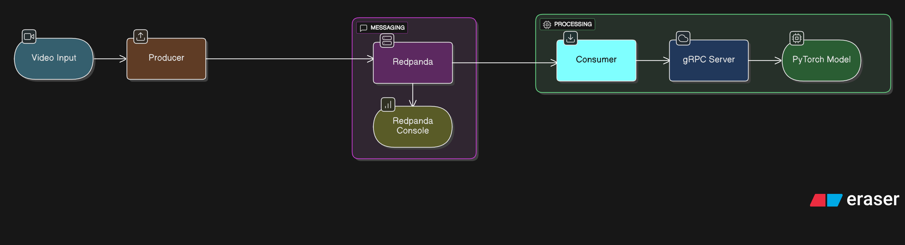

# Real-time Video Inference System -- Core Pipeline 

A minimal, real-time image classification pipeline using PyTorch, gRPC, and Redpanda streaming.

## 🏗️ Architecture



## 📁 Project Structure

```
core_pipeline/
├── inference_service/
│   ├── server.py               # gRPC inference server with PyTorch
│   ├── inference_pb2.py          # Generated gRPC code
│   ├── inference_pb2_grpc.py     # Generated gRPC code
│   ├── health_check.py         # Health check implementation for gRPC service, used by Docker health probe
│   └── imagenet_classes.txt    # ImageNet class labels
├── protos
│   └── inference.proto         # gRPC service definition
├── streaming_simulator/
│   ├── producer.py             # Kafka producer (video/webcam frames)
│   └── consumer.py             # Kafka consumer + gRPC client
├── Dockerfile                  # Multi-stage production Docker image
├── docker-compose.yml          # Complete system orchestration
├── requirements.txt            # Python dependencies created with uv
├── generate_grpc.sh           # Script to generate gRPC code
├── producer.log                # Log file for redpanda producer output, mounted in Docker
├── consumer.log                # Log file for redpanda consumer output, mounted in Docker
├── inference_service.log      # Log file for inference service output, mounted in Docker
├── Makefile                   # Convenience commands for setup and running
└── README.md                  # This file
```

## 🚀 Quick Start

### Prerequisites
- Docker & Docker Compose
- Python 3.11+ with uv package manager (recommended, a lot faster) or pip
- A video file or webcam (for testing)

### 1. Setup

The project provides a Makefile for _convenience_, but you can also run commands manually.

```bash
cd core_pipeline

# Option 1: Use Makefile 
make setup

# Option 2: Manual setup
pip install -r requirements.txt
# Generate gRPC code
bash generate_grpc.sh
```

### 2. Start the Complete Pipeline

```bash
# Option 1: Use Makefile
make up

# Option 2: Docker Compose directly
docker-compose up --build -d

# Check service health
make status
```

### 3. Stream Video Frames

```bash
# Option 1: Use Makefile for webcam
make producer

# Option 2: Use Makefile for video file
make producer-video VIDEO_PATH=/path/to/video.mp4

# Option 3: Run directly
python streaming_simulator/producer.py --mode webcam --duration 30
```

### 4. Monitor Performance

```bash
# View all logs
make logs

# View specific service logs
make logs-consumer
make logs-inference
```

```
==================================================
PERFORMANCE METRICS
==================================================
THROUGHPUT:
  Frames processed: 184
  Overall FPS: 6.11 (across 30.1s total runtime)
  Effective FPS: 8.50 (across 21.6s active time)
PROCESSING TIME:
  Average inference time: 21.3ms
  Recent average (last 100 frames): 20.8ms
  Range: 16.1ms - 50.0ms
ERRORS:
  Total errors: 0
  Error rate: 0.00%
==================================================
```

Producer and server logs are available in `producer.log` and `inference_service.log` respectively.

## Makefile Commands

For convenience, use the included Makefile:

```bash
# View all available commands
make help

# Common workflow
make setup          # Setup dependencies and gRPC code
make up             # Start all services  
make producer       # Run webcam producer
make logs           # View logs
make clean          # Clean up everything

# Development helpers
make status         # Check service status
make test           # Run end-to-end test
make restart        # Quick restart services
```

## 🔧 Configuration

### Environment Variables

| Variable | Default | Description |
|----------|---------|-------------|
| `KAFKA_SERVERS` | `localhost:9092` | Kafka bootstrap servers |
| `GRPC_SERVER` | `localhost:50051` | gRPC inference server address |

### Producer Options

```bash
python streaming_simulator/producer.py --help

# Key options:
--mode {video,webcam}     # Streaming source
--video-path PATH         # Video file path (for video mode)
--camera-id ID           # Camera ID (for webcam mode), default is 0
--duration SECONDS       # Streaming duration, default is 30 seconds
--fps FPS                # Frame rate limit, default is 10 FPS
--kafka-servers SERVERS  # Kafka brokers, default is localhost:9092
--topic TOPIC            # Kafka topic name, default is 'frames'
```

### Consumer Options

```bash
python streaming_simulator/consumer.py --help

# Key options:
--kafka-servers SERVERS  # Kafka brokers, default is localhost:9092
--grpc-server SERVER     # gRPC inference server, default is localhost:50051
--duration SECONDS       # Consumer runtime, default is 30 seconds
```

## 🧪 Testing

### 1. Health Checks

```bash

# Check Kafka connectivity
docker exec redpanda rpk topic list
```

### 2. End-to-End Test

```bash
# Terminal 1: Start services
docker-compose up -d

# See consumer logs (-f is for follow)
docker-compose logs -f consumer

# Terminal 2: Run producer for 30 seconds
python streaming_simulator/producer.py --kafka-servers localhost:19092 --mode webcam --duration 30 

# Observe consumer logs for classification results and metrics
```

### 3. Load Testing

```bash
# High FPS streaming test
python streaming_simulator/producer.py --kafka-servers localhost:19092 --mode webcam --fps 20 --duration 60

# Multiple producers
python streaming_simulator/producer.py --kafka-servers localhost:19092 --topic frames1 --mode webcam &
python streaming_simulator/producer.py --kafka-servers localhost:19092 --topic frames2 --mode webcam &
```

## 📊 Performance Metrics

The system automatically tracks and logs performance metrics in three key categories:

### THROUGHPUT
- **Frames Processed**: Total number of frames successfully processed
- **Overall FPS**: Average frames per second across total runtime
- **Effective FPS**: Higher frames per second rate calculated only during active processing time

### PROCESSING TIME
- **Average Inference Time**: Mean processing time per frame in milliseconds
- **Recent Average**: Moving average of the last 100 frames
- **Range**: Min-max processing times to show performance variability

### ERRORS
- **Total Errors**: Count of failed processing attempts
- **Error Rate**: Percentage of frames that failed processing

Metrics are printed every **30 seconds** and at the end of each run:

## 🔍 Troubleshooting

### Common Issues

1. **gRPC Connection Failed**
   ```bash
   # Check if service is running
   docker-compose ps
   
   # Check logs
   docker-compose logs inference_service
   ```

2. **Kafka Connection Failed**
   ```bash
   # Verify Redpanda is healthy
   docker-compose ps redpanda
   
   # Check Kafka topics
   docker exec redpanda rpk topic list
   ```

3. **Model Loading Issues**
   ```bash
   # Check inference service logs
   docker-compose logs inference_service
   
   # Verify Python dependencies
   docker-compose exec inference_service pip list
   ```

## 🛠️ Development

### Local Development

**NOTE:** This requirements.txt was generated with uv package manager:
`uv export --no-dev --no-hashes --format requirements-txt > requirements.txt`

```bash
# Install dependencies
pip install -r requirements.txt

# Generate gRPC code 
chmod +x generate_grpc.sh
./generate_grpc.sh

# Run inference service locally
python inference_service/server.py

# Run consumer locally
python streaming_simulator/consumer.py --kafka-servers localhost:19092
```
