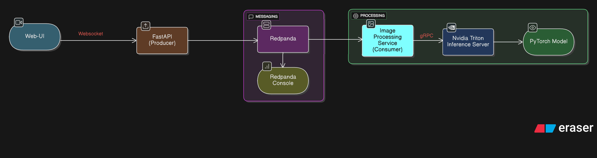

# Enhanced Video Inference Pipeline

A real-time video inference pipeline with web interface, built using FastAPI, Triton Inference Server, and Kafka streaming.

## Features

- **Web Interface**: Modern web UI for uploading videos/images and viewing real-time classification results
- **Triton Integration**: Uses NVIDIA Triton Inference Server for high-performance model serving
- **Kafka Streaming**: Asynchronous message processing with Redpanda 
- **Real-time WebSocket**: Live updates of classification results
- **Docker Containerization**: Easy deployment with Docker Compose
- **Performance Metrics**: Built-in performance tracking and logging in the web interface
- **Health Monitoring**: Health check endpoints for all services

## Architecture



## Quick Start

### Prerequisites

- Docker and Docker Compose
- Python 3.11+ (for local development)
- NVIDIA GPU (optional, for GPU acceleration)

### Setup and Run

1. **Setup the project:**
   ```bash
   cd enhanced_pipeline
   # Optionally, run pip install if not using UV from the root directory
   pip install -r requirements.txt
   
   # Run make setup create a .env file, create image directory and set up model for Triton Inference Server
   make setup
   ```

2. **Start all services:**
   ```bash
   make up
   ```

3. **Access the application:**
   - Web UI: http://localhost:8000
   - Redpanda Console: http://localhost:8080
   - Health Check: http://localhost:8000/health

4. **View logs:**
   ```bash
   make logs          # All services
   make logs-app      # FastAPI (producer) only 
   make logs-image-service # Image service (consumer) only
   ```

5. **Stop services:**
   ```bash
   make down
   
   # Stop a& remove containers, networks, and volumes
    make clean
   ```

## Configuration

The application can be configured using environment variables. Copy `.env.example` to `.env` and modify as needed:

```bash
cp .env.example .env
```

### Key Configuration Options

| Variable | Default | Description |
|----------|---------|-------------|
| `REDPANDA_SERVER` | `localhost:19092` | Kafka broker address |
| `TRITON_URL` | `localhost:8001` | Triton server gRPC endpoint |
| `PORT` | `8000` | FastAPI server port |
| `LOG_LEVEL` | `INFO` | Logging level |
| `VIDEO_FRAME_RATE` | `10` | Video processing frame rate |
| `CLEANUP_INTERVAL` | `300` | File cleanup interval (seconds) |

## Usage

### Web Interface

1. **Upload Video**: Select a video file and click "Process Video"
2. **Webcam**: Click "Start Webcam" for real-time camera feed processing
3. **View Results**: Real-time classification results appear in the right panel
4. **Performance**: Monitor FPS and processing metrics

### API Endpoints

OpenAPI documentation is available at: http://localhost:8000/docs

| Endpoint | Method | Description |
|----------|--------|-------------|
| `/` | GET | Web interface |
| `/api/upload-video/` | POST | Upload video for processing |
| `/api/upload-image/` | POST | Upload single image |
| `/api/process-frame/` | POST | Process webcam frame |
| `/api/cleanup/` | POST | Clean up old frame files |
| `/health` | GET | Health check |
| `/ws` | WebSocket | Real-time updates |

### Development

1. **Install dependencies:**
   ```bash
   # Run UV sync to install dependencies from the project root
   
   # Optionally, if not using UV, run pip install in this directory (/enhanced_pipeline)
   pip install -r requirements.txt
   ```

2. **Run locally (requires Redpanda and Triton running):**
   ```bash
   # Run FastAPI development server
   fastapi dev main.py 
   ```

3. **Run image service:**
   ```bash
   python streaming-simulator/image-service.py
   ```

## Project Structure

```
enhanced_pipeline/
├── main.py                 # FastAPI application entry point
├── config.py              # Configuration management
├── requirements.txt       # Python dependencies
├── Dockerfile             # Multi-stage Docker build
├── docker-compose.yaml    # Service orchestration
├── Makefile              # Convenience commands
├── .env.example          # Environment configuration template
├── api/
│   ├── endpoints.py       # API route handlers
│   └── websockets.py      # WebSocket connection management
├── static/
│   ├── index.html         # Web interface
│   ├── app.js            # Frontend JavaScript
│   └── images/           # Uploaded/processed images
├── streaming-simulator/
│   └── image-service.py   # Kafka consumer & Triton client
└── model_repository/
    └── resnet18/          # Triton model configuration
```


### Potential Issues

1. **Port conflicts**: Check if ports 8000, 8001, 8080, 19092 are available
2. **GPU not detected**: Ensure NVIDIA Docker runtime is installed
3. **Connection errors**: Verify all services are running with `make health`

### Logs and Debugging

```bash
# Check service health
make health

# View specific service logs
docker-compose logs -f enhanced-pipeline
docker-compose logs -f inference-server
docker-compose logs -f redpanda-0

# Check Kafka topics
docker-compose exec redpanda-0 rpk topic list
```
